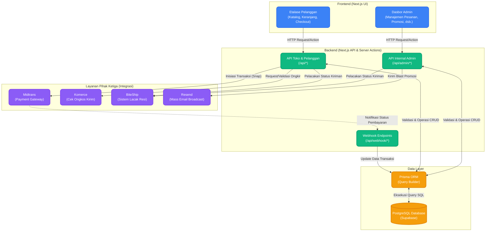

# Arsitektur Sistem KKF Label

Dokumen ini memaparkan gambaran umum mengenai arsitektur sistem dari proyek **KKF Label**, dengan fokus pada antarmuka (*Frontend*), logika pemrosesan (*Backend*), manajemen data (*Database*), serta integrasi dengan layanan eksternal.

## Diagram Alur Arsitektur Sistem

Berikut adalah diagram yang memetakan aliran data dan interaksi antar komponen dalam sistem menggunakan sintaks Mermaid.js:

## Penjelasan Modul Sistem

Sistem KKF Label dibangun dengan arsitektur berbasis komponen modern menggunakan Next.js (App Router), yang secara efektif menyatukan lapisan UI dan logika _server-side_ di dalam satu wadah proyek (monorepo).

### 1. Frontend (Next.js UI)
Berperan sebagai antarmuka pengguna yang berinteraksi langsung dengan pelanggan maupun administrator.
- **Etalase Pelanggan (*Customer UI*)**: Menyajikan katalog produk, sistem keranjang (*cart*), ulasan, dan halaman *checkout* kepada pembeli. Dioptimalkan untuk kecepatan pemuatan halaman dan pengalaman pengguna (*User Experience*).
- **Dasbor Admin (*Admin UI*)**: Pusat kendali yang terproteksi oleh autentikasi, digunakan oleh pemilik toko atau admin untuk mengelola stok, melihat pesanan masuk, mengonfirmasi pembayaran, hingga mengirimkan promosi (*email broadcast*). 

### 2. Backend (Next.js API & Server Actions)
Lapisan logika bisnis yang menangani autentikasi, validasi *payload*, aturan bisnis, dan komunikasi dengan *database* serta pihak luar.
- **API Internal Admin & API Toko**: *Endpoint* yang didesain secara khusus untuk melayani permintaan dari UI (seperti pembuatan pesanan, penambahan produk, pengiriman email promosi).
- **Webhook Endpoints**: Rute API pasif yang bertugas 'mendengarkan' permintaan masuk dari layanan eksternal. Secara khusus, *webhook* digunakan untuk menangkap notifikasi *real-time* dari Midtrans ketika pembayaran pelanggan berhasil atau dibatalkan.

### 3. Data Layer (Prisma ORM & Supabase)
Lapisan ini mengelola skema penyimpanan data transaksi secara konsisten.
- **PostgreSQL Database (Supabase)**: Layanan *database* *cloud* utama yang menyimpan seluruh entitas sistem (seperti Pengguna, Pesanan, Produk, dan Afiliasi).
- **Prisma ORM**: *Object-Relational Mapping* (ORM) yang memfasilitasi komunikasi antara lapisan Backend dan Database. Prisma menyediakan keamanan tipe (*type safety*) dan mempermudah manipulasi data melalui operasi CRUD (Create, Read, Update, Delete) yang terstruktur tanpa perlu menulis *query* SQL secara manual.

### 4. Layanan Pihak Ketiga (Integrasi)
Sistem KKF Label mendelegasikan beberapa fitur esensial kepada layanan eksternal (*third-party services*) untuk menjamin skalabilitas dan keandalan sistem:
- **Midtrans**: Menangani ekosistem pembayaran digital (transfer bank, *e-wallet*, kartu kredit) agar toko dapat menerima dana secara aman dan otomatisasi verifikasi pembayaran via *webhook*.
- **Komerce**: Mengalkulasi biaya ongkos kirim secara dinamis berdasarkan kurir, bobot barang, dan titik alamat pengiriman pelanggan.
- **BiteShip**: Melacak status resi paket pengiriman (*tracking*) agar pelanggan maupun admin mengetahui letak terkini paket.
- **Resend**: Bertugas mengirimkan surel promosi secara massal (*broadcast*) kepada para pelanggan dari Dasbor Admin, menggunakan *Batch API* untuk penanganan email berkapasitas besar.

---
*Dokumen ini dibuat secara otomatis dan mewakili potret terkini dari arsitektur platform E-Commerce KKF Label.*
